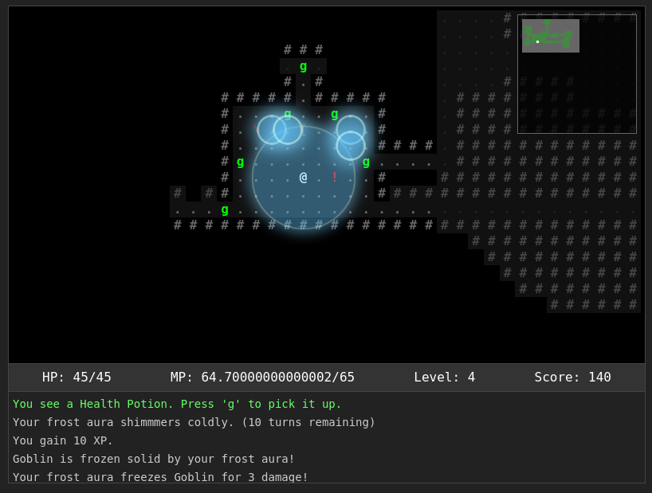

# Lila RL - Modular Roguelike Game

A browser-based roguelike game built with modern JavaScript using a component-based entity system and a data-driven approach inspired by ADOM, UO, DF, D1, D2, CoQ, TOME, Catacylsm RL and ADND 

## Licence 
Creative Commons Attribution-NonCommercial 4.0 International License
This project is licensed under the [Creative Commons Attribution-NonCommercial 4.0 International License](LICENSE.md).
https://github.com/integralyogin/lila_rl/blob/master/LICENSE.md

## Screenshot



## Play Online
Play Lila RL at: [The Infinite Library](http://theinfinitelibrary.net/games/lila_rl/)


## Features

- Procedurally generated dungeons
- Data-driven world design using JSON configuration
- Turn-based gameplay
- Field of view and exploration
- Combat system
- Items and inventory management
- Monsters with basic AI
- Experience and leveling
- NPCs with dialogue
- Shops and trading

## Architecture

The game is built using a component-based entity system with a modular, data-driven architecture:

- **Entity Component System**: Entities are composed of reusable components
- **Event System**: Modules communicate via events
- **Systems**: Logic is separated into independent systems (rendering, input, FOV, etc.)
- **State Management**: Centralized game state
- **Data-Driven Design**: Game content is defined in JSON files for easy modification

## Directory Structure

```
/rogue2/
├── data/                # Game data as JSON
│   ├── maps/            # Map definitions and configurations  
│   │   ├── town.json      # Town map layout and NPCs
│   │   ├── dungeon.json   # Dungeon generation parameters
│   │   ├── forest.json    # Forest area definition
│   │   └── ...            # Other map areas
│   ├── items.json       # Item definitions
│   ├── monsters.json    # Monster definitions
│   ├── player.json      # Player starting stats
│   ├── shops/           # Shop inventories
│   └── spellbooks.json  # Magic spell definitions
├── src/
│   ├── core/            # Core game engine code
│   │   ├── eventEmitter.js   # Event system
│   │   └── gameState.js      # Global state management
│   ├── entities/        # Entity-related code
│   │   ├── entity.js         # Base entity class
│   │   ├── entityFactory.js  # Factory for creating entities
│   │   └── components.js     # Entity components
│   ├── systems/         # Game systems
│   │   ├── fovSystem.js      # Field of view calculations
│   │   ├── inputSystem.js    # Input handling
│   │   └── renderSystem.js   # Rendering
│   ├── ui/              # User interface components
│   │   ├── inventoryUI.js    # Inventory screen
│   │   ├── shopUI.js         # Shop interface
│   │   └── ...               # Other UI components
│   ├── world/           # World generation
│   │   ├── map.js            # Map data structure
│   │   ├── dungeonGenerator.js # Procedural dungeon generation
│   │   └── townGenerator.js  # Town generation
│   ├── constants.js     # Game constants and configuration
│   └── game.js          # Main game initialization
├── index.html           # Entry point HTML
└── style.css            # Global styles
```

## Controls

- **Arrow keys**: Move/attack
- **i**: Open inventory
- **e**: Pick up item
- **>**: Use stairs (when standing on them)
- **.** or **5**: Wait a turn

## Running the Game

Open `index.html` in a web browser to play the game.

## Data-Driven Design

The game uses a data-driven approach with JSON files that define game content:

### Map System

Maps are defined in JSON files in the `data/maps/` directory:

- **Town maps** (like `town.json`): Define buildings, NPCs, shops, and exit points
- **Dungeon configuration** (`dungeon.json`): Define parameters for procedural dungeon generation
- **Area maps** (like `forest.json`, `hills.json`): Define specialized areas with their own NPCs and items

### Entity Templates

Entities are defined in JSON files:

- **monsters.json**: Defines monster types, stats, and loot
- **items.json**: Defines weapons, armor, potions, and other items
- **spellbooks.json**: Defines magical spells and their effects

### Modular Entity System

The game uses a modular entity system where:

- Entity templates are defined centrally in the respective JSON files (`monsters.json`, `items.json`)
- Maps can reference these entities by ID without duplicating the entity data
- The entity factory handles instantiation based on the template data

For example, a map can define monster spawns like this:

```json
"monsters": [
  { "id": "goblin", "weight": 70 },
  { "id": "orc", "weight": 20 },
  { "id": "troll", "weight": 10 }
]
```

This references the monster definitions in `monsters.json` instead of duplicating the monster data. The game will automatically look up the full monster template when needed.

### Adding Content

To add new content to the game:

1. **New map area**: Create a new JSON file in `data/maps/` defining the area's layout, NPCs, exits, and entity references
2. **New monster**: Add a new monster definition to `monsters.json`
3. **New item**: Add a new item definition to `items.json`
4. **Reference in maps**: Use the ID from your monster/item definitions when adding them to maps

## Extending the Game Code

New features can be added by:

1. Adding new components to `components.js` to enable new entity behaviors
2. Creating new entity types in `entityFactory.js`
3. Adding new systems or extending existing ones
4. Adding new JSON data files to define game content

### Adding New Spells

The spell system is modular and data-driven. To add a new spell:

1. Add a new spell definition to `data/spellbooks.json` with appropriate properties
2. Register the spell implementation in `src/spells/spell_logic.js`

Example spell JSON structure:
```json
{
  "id": "fireball",
  "name": "Fireball Spellbook",
  "char": "+",
  "color": "#ff4500",
  "type": "spellbook",
  "spellId": "fireball",
  "spellName": "Fireball",
  "description": "A powerful fire spell that damages multiple enemies.",
  "element": "fire",
  "manaCost": 12,
  "baseDamage": 14,
  "range": 6,
  "aoeRadius": 2,
  "price": 150,
  "effects": ["damage", "area_effect"],
  "tags": ["attack", "fire", "area", "target"]
}
```

The spell_logic.js file handles all the logic for targeting and casting spells, so you only need to implement the spell's effects there without modifying the UI code.
